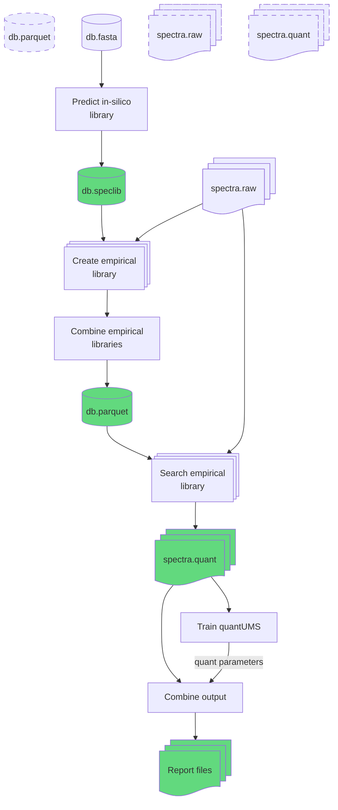

# lehtiolab/nf-diann
**A Data-Independent Analysis pipeline based on DIA-NN**

[](https://www.nextflow.io/)
[](https://www.docker.com/)

This Nextflow workflow uses [DIA-NN](https://github.com/vdemichev/DiaNN) to analyze mass spectrometry proteomics data acquired
using data-independent analysis (DIA). It runs on multiple compute infrastructures in a portable manner, and scales
horizontally over e.g. HPC nodes by parallelizing jobs.


## How to run

- install [Nextflow](https://nextflow.io)
- install [Docker](https://docs.docker.com/engine/installation/) or [Singularity](https://www.sylabs.io/guides/3.0/user-guide/)
- run pipeline, e.g.:

```
nextflow run lehtiolab/nf-diann -profile docker -resume \
    --input /path/to/input_definition.txt \
    --tdb /path/to/proteins.fa \
    --ms1acc 10 --ms2acc 10
```

One can pass a library using `--library libfile.speclib` or `--libfile.parquet`, where the pipeline assumes the former
to be a predicted in-silico library (i.e. only used fasta as input data), which will be used to generate an empirical
library using raw spectra data input files. The second invocation using a parquet file is assumed to be an 
empirical library, which will go directly to the next step (search raw files).




