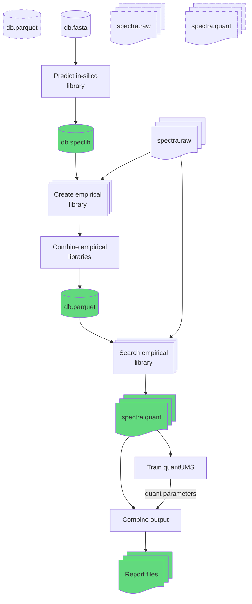

# lehtiolab/nf-diann
**A Data-Independent Analysis pipeline based on DIA-NN**

[](https://www.nextflow.io/)
[](https://www.docker.com/)

This Nextflow workflow uses [DIA-NN](https://github.com/vdemichev/DiaNN) to analyze mass spectrometry proteomics data acquired
using data-independent analysis (DIA). It runs on multiple compute infrastructures in a portable manner, and scales
horizontally over e.g. HPC nodes by parallelizing jobs.


## How to run

- install [Nextflow](https://nextflow.io)
- install [Docker](https://docs.docker.com/engine/installation/) or [Singularity](https://www.sylabs.io/guides/3.0/user-guide/)
- run pipeline, e.g.:

```
nextflow run lehtiolab/nf-diann -profile docker -resume \
    --input /path/to/input_definition.txt \
    --tdb /path/to/proteins.fa \
    --ms1acc 10 --ms2acc 10
```

One can pass a library using `--library libfile.speclib` or `--libfile.parquet`, where the pipeline assumes the former
to be a predicted in-silico library (i.e. only used fasta as input data), which will be used to generate an empirical
library using raw spectra data input files. The second invocation using a parquet file is assumed to be an 
empirical library, which will go directly to the next step (search raw files).


```mermaid
flowchart TD
    V@{shape: database, label: "db.speclib"}
    V@{shape: database, label: "db.parquet"}

    A[(db.fasta)] --> B@{shape: rect, label: "Predict in-silico
    library"}
    T@{shape: docs, label: "spectra.raw"}
    U@{shape: docs, label: "spectra.quant"}

    B --> C[(db.speclib)]
    C -->D@{shape: procs, label: "Create empirical
            library"}
    D --> G@{shape: rect, label: "Combine empirical
             libraries"}
    G --> E[(db.parquet)]
    E --> F@{shape: procs, label: "Search empirical
    library"}
    H@{shape: docs, label: "spectra.raw"} --> D
    H --> F
    F --> I@{shape: docs, label: "spectra.quant"}
    I --> J@{shape: rect, label: "Train quantUMS"}
    I --> K@{shape: rect, label: "Combine output"}
    J --> |quant parameters| K
    K --> L@{shape: docs, label: "Report files"}

    style L fill: #62D97E
    style E fill: #62D97E
    style I fill: #62D97E
    style C fill: #62D97E
    style T stroke-dasharray: 8
    style U stroke-dasharray: 8
    style V stroke-dasharray: 8
```

## Parameters
```
  --ms1acc                    MS1 accuracy in PPM
  --ms2acc                    MS2 accuracy in PPM
  --window                    Scan window size
  --varmods                   Variable modifications, default is 'UniMod:35,15.994915,M', add more with separator ;
  --fixmods                   Fixed modifications, default is 'UniMod:4,57.021464,C', add more with separator ;
  --ntermmetexcision          Include excision of N-terminal methionine as mod
  --ntermacetyl               Include actelylation of N-terminal as mod
  --maxvarmods                Max nr of variable modifications
  --miscleav                  Allowed nr of missed cleavages, default 1
  --precconflvl               Precursor q-value threshold, default 0.01  (--matrix-qvalue)
  --proteinconflvl            Protein q-value threshold, default 0.01 (--matrix-spec-q)
  --mincharge                 Min precursor charge, def 2
  --maxcharge                 Max precursor charge, def 4
  --minmz                     Min precursor m/z, def 300 
  --maxmz                     Max precursor m/z, def 1300
  --minfragmz                 Min fragment m/z, def 200
  --maxfragmz                 Max fragment m/z, def 1800
  --minpeplen                 Min peptide length, def 8
  --maxpeplen                 Max peptide length, def 40
  --nonorm                    No normalization
  --proteotypicity            default 2=genes, 0=isoforms2, 1=protein names
  --ids_to_names              DIANN --ids-to-names for when using isoforms
  --enzyme                    Default 'trypsin', use otherwise trypsinp (cuts after P)
  --exclude_contaminants      Exclude possible contaminants, specify a tag, e.g. 'cRAP-'
  --individual_massacc        Not recommended with reusing quantfiles
  --individual_windows        Not recommended with reusing quantfiles

  --batchsize                 Amount of files in a parallel batch, 0: all files in same batch
  --quantdir                  Dir where .quant files to reuse are in

  # What files to output, if none specified all are output
  --output_pred_lib           Output the predicted library
  --output_emp_lib            Output the empirical library
  --outputquant               Output the .quant files
  --outputreport              Output a report html file
```
